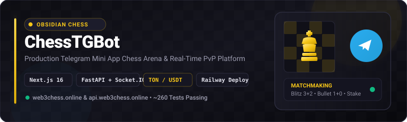
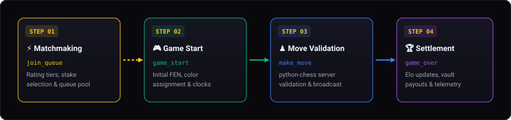
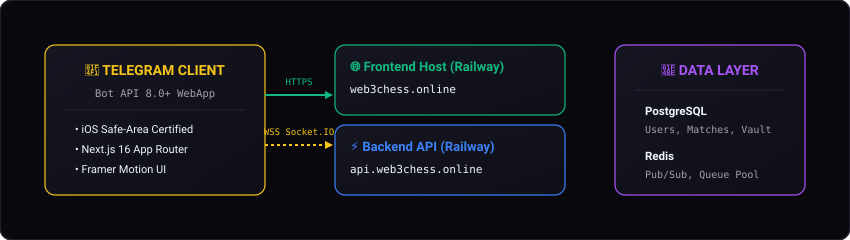
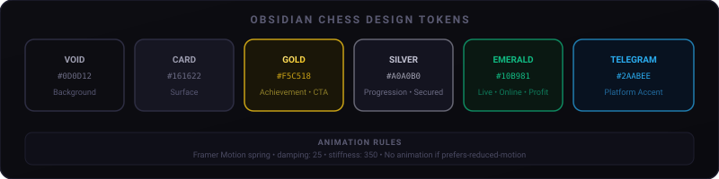

<p align="center">
  
</p>

<p align="center">
  <a href="https://web3chess.online"></a>
  <a href="https://api.web3chess.online"></a>
  
  
  
</p>

---

## ♟️ Overview & Value Proposition

**ChessTGBot** is a production-grade Telegram Mini App chess platform engineered for competitive PvP matchmaking, real-time gameplay, and game telemetry inside Telegram.

Built on a **Next.js 16 (App Router)** client and a **FastAPI + Socket.IO** real-time server, the application delivers the **Obsidian Chess** experience—a dark, high-contrast, tactile UI optimized for Telegram mobile viewports and iOS safe-area insets.

```text
Audience: Telegram Mini App players seeking Web3 competitive chess & developers building production Telegram WebApps.
One-Sentence Value: Real-time Telegram Mini App chess arena with high-stakes PvP, TON/USDT vault, and Obsidian Chess UI.
Primary Proof: Dual Railway production services, ~260 backend integration tests, static-export CI guard, and Bot API 8.0+ fullscreen compliance.
First Action: Launch the app in Telegram or run `docker-compose up -d && pytest` locally.
```

---

## 🔄 Real-Time Game Loop & State Machine

The core match lifecycle is managed through Socket.IO WebSocket connections and backed by `python-chess` move validation on the server:

<p align="center">
  
</p>

### Socket.IO Event Lifecycle

| Event Name | Direction | Payload Description |
| --- | --- | --- |
| `join_queue` | Client → Server | Rating tier, time control (e.g. 3+2, 1+0), optional wager stake. |
| `game_start` | Server → Client | Opponent profile, match UUID, initial FEN, white/black color assignment. |
| `make_move` | Client → Server | UCI move string (e.g. `e2e4`), client clock timestamp, move nonce. |
| `move_made` | Server → Client | Updated FEN, last move highlight, remaining clock time for both players. |
| `draw_offer` / `draw_respond` | Bidirectional | Interactive draw offer modal with accept/decline nonces. |
| `game_over` | Server → Client | Termination reason (checkmate, timeout, resignation, draw), rating update, XP payout. |

---

## 📐 Production Topology & Host Routing

The application operates across **two separate Railway services** auto-deployed on push to `main`:

<p align="center">
  
</p>

### Service Endpoint Reference

| Component | Production Domain | Railway Internal Host | Tech Stack |
| --- | --- | --- | --- |
| **Frontend** | [`web3chess.online`](https://web3chess.online) | [`chesstgbot-frontend-production.up.railway.app`](https://chesstgbot-frontend-production.up.railway.app) | Next.js 16 (App Router), `next start` |
| **Backend API** | [`api.web3chess.online`](https://api.web3chess.online) | [`chesstgbot-backend-production.up.railway.app`](https://chesstgbot-backend-production.up.railway.app) | FastAPI, Socket.IO, SQLAlchemy, Redis |

> [!CAUTION]
> The single-container monolith host (`chesstgbot-production.up.railway.app`) is **DEAD / INACTIVE**. Do not test against or send traffic to it. Runtime routing in [`frontend/src/lib/api.ts`](frontend/src/lib/api.ts) maps `web3chess.online` directly to `api.web3chess.online`.

---

## 🎨 Obsidian Chess Design System

Visual presentation follows [`BRAND_DESIGN_SYSTEM.md`](BRAND_DESIGN_SYSTEM.md). Obsidian Chess prioritizes dark obsidian surfaces, Gold achievement accents, and tactical board grid motifs:

<p align="center">
  
</p>

### Design System Rules

- **Default Theme**: Obsidian Chess (`#0D0D12` void, `#161622` card background).
- **Gold Accent (`#F5C518`)**: Reserved exclusively for achievements, primary CTA buttons, rating ranks, and active match stakes.
- **Silver Status (`#A0A0B0`)**: Used for progression milestones, secondary action buttons, and secured UI states.
- **Micro-Animations**: Framer Motion transitions with spring physics (`damping: 25`, `stiffness: 350`).
- **Tactile Grid**: 36px radial dot grids and subtle chess board rank/file keylines.

---

## 📱 Hard-Won Engineering Conventions

### 1. iOS Telegram WebApp Fullscreen Safe-Area
- In fullscreen mode (`tg.requestFullscreen()`, Bot API 8.0+), iOS Telegram defines `--tg-content-safe-area-inset-bottom: 0px`. Standard CSS `var()` fallback chains short-circuit at `0px` and ignore `env(safe-area-inset-bottom)`.
- **Rule**: Bottom insets **MUST** combine with `max()`, exposed via `--app-safe-bottom` in [`frontend/src/app/globals.css`](frontend/src/app/globals.css).
- **Navigation Safety**: The bottom navigation bar is **never** conditionally hidden on main dashboard pages (`shouldHideNavbar` in `frontend/src/components/LayoutWrapper.tsx`). Overlays use `z-index >= 100`.

### 2. Money & Bot Security Rules
- **HTML Escaping**: All user-controlled strings (especially Telegram display names) **MUST** be HTML-escaped before entering `parse_mode="HTML"` bot messages to prevent entity parsing crashes.
- **Withdrawals**: Payouts below auto-review threshold remain as `pending_confirmation` until confirmed via HMAC nonce in Telegram bot chat ([`backend/app/services/withdrawal_confirmation.py`](backend/app/services/withdrawal_confirmation.py)).
- **Admin Alert Routing**: System errors log via `app.bot.errors` and map to named systems (`GAME CLIENT`, `CORE API`, `TREASURY`, `REALTIME`, `SECURITY`) in [`backend/app/core/alerts.py`](backend/app/core/alerts.py).

### 3. Static Export Guard (`static-export-fresh`)
- CI runs `bash scripts/check-static-export-fresh.sh` on every pull request. Modifying `frontend/src` without updating `backend/static_frontend` fails the build.
- Rebuild static bundle locally after frontend changes:
  ```bash
  cd frontend && npm run build:static
  ```

---

## 🚀 Quickstart & Developer Workflow

### Prerequisites
- Node.js 20+ & npm 10+
- Python 3.11+
- Docker & Docker Compose

### 1. Start Local Infrastructure (Postgres + Redis)
```bash
git clone https://github.com/VladislavBrodsky/ChessTGBot.git
cd ChessTGBot

# Spin up Postgres and Redis containers
docker-compose up -d
```

### 2. Launch FastAPI Backend
```bash
python3 -m venv .venv
source .venv/bin/activate

pip install -r backend/requirements.txt
cd backend
uvicorn app.main:app --reload --port 8000
```

### 3. Launch Next.js Frontend
```bash
cd frontend
npm ci
npm run dev
```

Visit `http://localhost:3000` to play locally.

---

## 🧪 Verification & Testing

| Suite | Command | Coverage / Scope |
| --- | --- | --- |
| **Backend Integration** | `cd backend && python -m pytest` | ~260 pytest cases testing DB models, game state, Redis pub/sub, and auth |
| **Frontend Unit Tests** | `cd frontend && npm test` | 11 Jest suites covering navbar context, modals, SWR hooks, and game UI |
| **Static Export Guard** | `bash scripts/check-static-export-fresh.sh` | CI freshness guard comparing `frontend/src` changes against `backend/static_frontend` |

---

## 📁 Repository Map

```text
ChessTGBot/
├── assets/readme/           # Project-native SVG visual assets (hero, architecture, game-loop, brand)
├── backend/                 # FastAPI + Socket.IO application
│   ├── app/                 # Core engine, bot handlers, database models, services
│   ├── static_frontend/     # Committed static export (monolith deployment fallback)
│   └── tests/               # Pytest suite (~260 tests)
├── frontend/                # Next.js 16 App Router application
│   ├── src/app/             # Pages, internationalized routes, globals.css
│   ├── src/components/      # Obsidian Chess UI primitives & game boards
│   └── src/lib/             # Socket.IO client, API fetcher, Telegram SDK wrappers
├── scripts/                 # Maintenance scripts (check-static-export-fresh.sh)
├── AGENTS.md                # Engineering conventions & production rules
├── BRAND_DESIGN_SYSTEM.md   # Authoritative Obsidian Chess visual specification
└── docker-compose.yml       # Local Postgres & Redis configuration
```

---

## 📜 License

Distributed under the [MIT License](LICENSE).
